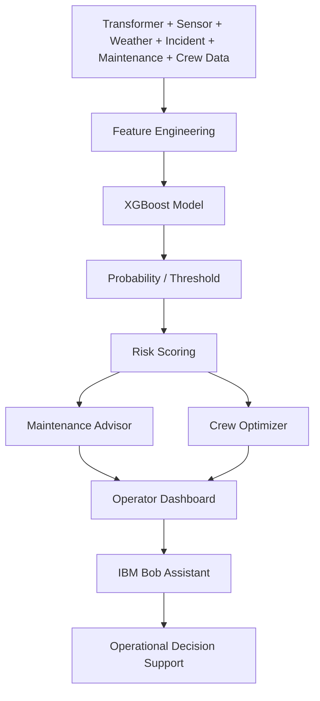

# Architecture

## High-level flow

## Components

- Data layer: CSV-based source data in `src/data`
- Feature engineering: handles rolling windows, trends, incident and maintenance features
- Model layer: evaluates the saved XGBoost pipeline and applies threshold 0.55
- Risk engine: translates probability into LOW/MEDIUM/HIGH/CRITICAL and P1/P2/P3/P4 priorities
- Advisor layer: recommends maintenance and crew actions
- API layer: exposes health, dashboard, transformer, risk, and prediction endpoints
- Frontend: operational dashboard, maps, risk tables, details, and aid tools
- Bob layer: answers grounded questions using current application data
